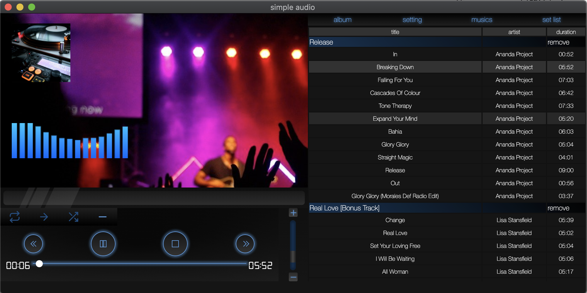
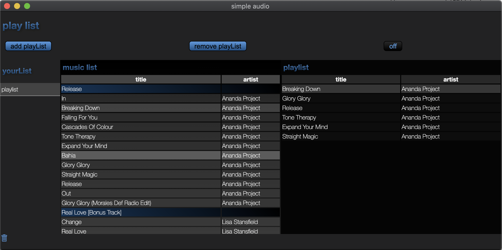

<h1>simple audio</h1>

<h2>I developed audio player on Electron</h2>

    this is a simple audio player based on Electron.
    it has basic functions like play music , create playlist ...etc.
    other than that it has visual function like set background image , video or 
    select theme color.

<h3>how to start the app</h3>

move the app directory on terminal. and put the command "npm start"

<h3>how to use it</h3>

    it can load music from folder.
    push album button at top of the left on music list form.
    call dialog and select album folder.
    even you could drag album folder and drop on music list form.

<h3>play list</h3>

    you can create play list on play list form.
    just drag from music list to play list form

<h3>set UI and image</h3>

    you can set background image even you can watch video while you are listening music.
    and you could set effect blur effect and contrast.

use font for some texts from <a href="https://www.keshikan.net/fonts.html">here</a>
